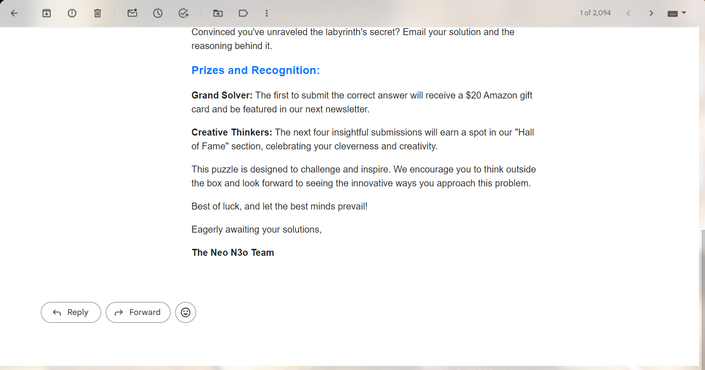
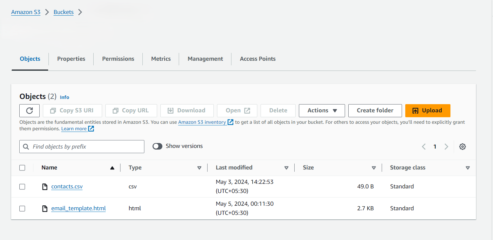
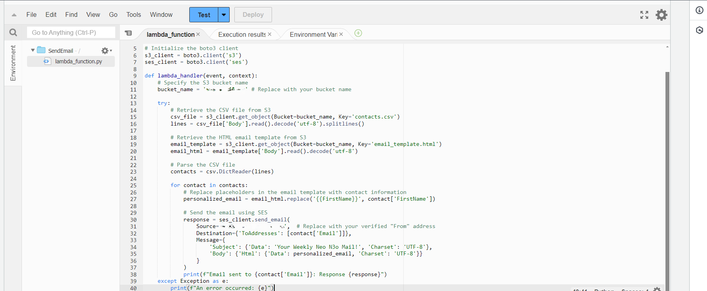

# 📧 MailerDome: Serverless Email Marketing Application on AWS

Welcome to **MailerDome**! 🎉 MailerDome is a fully serverless email marketing application built on AWS, leveraging various AWS resources to deliver a scalable, cost-effective, and efficient email marketing solution. This README will guide you through the application's architecture, key features, and the AWS resources used.

## 🚀 Introduction

MailerDome is designed to help businesses manage and execute email marketing campaigns effortlessly. With its serverless architecture, you can scale your email campaigns seamlessly, without worrying about server management or infrastructure costs. 

## 📦 Key Features

- **Serverless Architecture:** No need to manage servers or infrastructure.
- **Scalable and Cost-Effective:** Pay only for what you use.
- **Easy Integration:** Simple API for integrating with your existing systems.
- **AWS Powered:** Utilizes the power of AWS for reliability and performance.

## 🛠️ AWS Resources

MailerDome leverages a variety of AWS services to achieve its functionality:

### 1. 🗄️ Amazon S3 (Simple Storage Service)
Amazon S3 is used for storing email templates, campaign data, and other static assets. It provides secure, durable, and scalable storage.

### 2. 📬 Amazon SES (Simple Email Service)
Amazon SES is the core service for sending emails. It allows you to send bulk emails with high deliverability rates and detailed analytics.

### 3. 🔄 AWS Lambda
AWS Lambda functions handle the serverless execution of various tasks, including processing incoming requests, sending emails, and managing campaigns.

### 4. 🧰 Amazon API Gateway
Amazon API Gateway provides a secure and scalable API endpoint for the application. It routes requests to the appropriate Lambda functions.

### 5. 🛡️ AWS IAM (Identity and Access Management)
AWS IAM is used for managing permissions and access controls, ensuring that only authorized users and services can access the application's resources.

### 6. 📊 Amazon CloudWatch
Amazon CloudWatch is used for monitoring the application's performance and logging. It helps in tracking metrics, setting alarms, and debugging issues.

### 7. 📦 AWS DynamoDB
AWS DynamoDB is a fast and flexible NoSQL database service used for storing campaign metadata, user information, and other dynamic data.

### 8. 📈 AWS SNS (Simple Notification Service)
AWS SNS is used for sending notifications and alerts related to email campaigns, such as delivery status and bounce rates.

### 9. 🔄 AWS Step Functions
AWS Step Functions orchestrate complex workflows, such as multi-step email campaigns and automated follow-ups.

## 🌟 Getting Started

To get started with MailerDome, follow these steps:

1. **Clone the Repository:**
    ```bash
    git clone https://github.com/yourusername/MailerDome.git
    ```

2. **Install Dependencies:**
    Navigate to the project directory and install the necessary dependencies.
    ```bash
    cd MailerDome
    npm install
    ```

3. **Deploy to AWS:**
    Use AWS SAM or Serverless Framework to deploy the application to your AWS account.
    ```bash
    sam deploy --guided
    ```

4. **Configure SES:**
    Verify your domain and email addresses in Amazon SES.

5. **Run the Application:**
    Start sending email campaigns by invoking the API endpoints.

## Images

1. Email
   
   

   
   
3. S3 Bucket
   
   
   
5. Lambda Function
   
   
   
## 🤝 Contributing

We welcome contributions! Please read our [Contributing Guidelines](CONTRIBUTING.md) for more details on how to get involved.

## 📄 License

This project is licensed under the MIT License. See the [LICENSE](LICENSE) file for details.

---

Thank you 🚀📧
